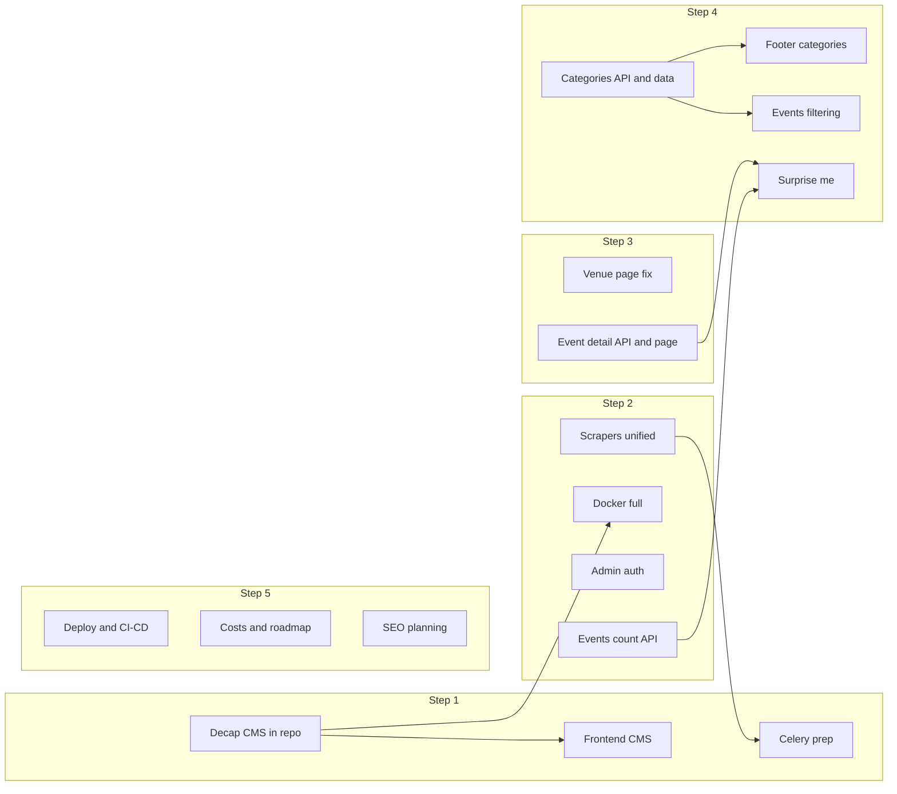

# SRQ Happenings: 6-Step Roadmap

This plan expands your high-level steps into concrete tasks, file touchpoints, and decisions. Each step can be tackled in order; you do not need to complete everything at once.

---

## Current state (from codebase)

- **Monorepo**: `apps/api` (FastAPI), `apps/web` (Next.js 16), `compose.db.yml` (Postgres only).
- **Articles**: Hardcoded in [apps/web/src/app/components/home/ArticlesSection.tsx](apps/web/src/app/components/home/ArticlesSection.tsx) (`MOCK_ARTICLES`); articles page reuses same section.
- **Hero**: [apps/web/src/app/components/home/HeroSection.tsx](apps/web/src/app/components/home/HeroSection.tsx) shows static "42 Events this week" and "Surprise me" links to `/events` (no backend).
- **Events API**: [apps/api/app/routers/events.py](apps/api/app/routers/events.py) has `/day` and `/range` only; no count endpoint, no single-event by id/slug, no category/filter query params.
- **Venue page**: [apps/web/src/app/venues/[slug]/page.tsx](apps/web/src/app/venues/[slug]/page.tsx) is a client component that uses `params.slug`; in Next.js 15+, `params` is a Promise in dynamic routes, so destructuring `params.slug` synchronously can break (likely cause of "never worked").
- **Event cards**: [apps/web/src/app/components/home/EventCardLarge.tsx](apps/web/src/app/components/home/EventCardLarge.tsx) links to `event.event.external_url` or `/events`—no internal event detail page.
- **Scrapers**: [apps/api/scripts/](apps/api/scripts/) (e.g. `scrape_selby.py`, `scrape_bigtop.py`, `scrape_mustdo.py`) have inconsistent CLI args (e.g. Selby has `--filters`, `--list-categories`, `--future-only`; MustDo has no `--categories` or `--future-only`; BigTop has no `--max-pages`).
- **Admin**: [apps/api/app/routers/admin.py](apps/api/app/routers/admin.py), `admin_venues`, `admin_ingest_items` are mounted with no auth.
- **Categories**: DB has `categories`, `event_categories` and `SourceFeed.categories` (string); events API does not expose or filter by category.
- **Footer**: [apps/web/src/app/components/Footer.tsx](apps/web/src/app/components/Footer.tsx) category links (Music, Arts & Culture, etc.) all go to `/events` with no query params.
- **Submit**: [apps/web/src/app/submit/page.tsx](apps/web/src/app/submit/page.tsx) uses `mailto:` only; no API or admin list.

---

## Step 1: CMS (Decap), hosting, and scraping automation

**Goal:** Add Decap CMS to the monorepo, serve real articles to the frontend, and plan hosting + Celery so scraping can run on a schedule.

### 1.1 Add Decap CMS to the monorepo

- Add Decap CMS in `apps/web` (or `apps/cms` if you prefer a dedicated app) using a Git-based backend (GitHub or GitLab) so content is stored as markdown/JSON in the repo.
- Define an **articles collection** aligned to the frontend expectations: title, excerpt, category, readTime, image, optional slug, publishedAt, and body.
- Create a content folder (e.g. `apps/web/content/articles/`) and add a few sample entries so the frontend can be wired end-to-end.
- Note: Strapi can still be introduced later as a separate step if you decide you want a hosted database-backed CMS.

### 1.2 Connect frontend to Decap content

- **Environment**: Add `NEXT_PUBLIC_DECAP_BACKEND` (optional) or document Git credentials setup for Decap (Netlify Identity if hosted there, or GitHub OAuth when self-hosted).
- **Data fetching**: Add a small content loader (e.g. in `apps/web/src/lib/content.ts`) to read markdown/JSON from the content folder at build time. Map front matter to the current `Article` type used by `ArticlesSection`.
- **Replace mock data**: In [apps/web/src/app/components/home/ArticlesSection.tsx](apps/web/src/app/components/home/ArticlesSection.tsx), remove `MOCK_ARTICLES` and load articles from the content folder. On [apps/web/src/app/articles/page.tsx](apps/web/src/app/articles/page.tsx), list all articles from content; add a dynamic route `articles/[slug]` that renders markdown for the full article.
- **Images**: Store images in a public or content-managed folder (e.g. `apps/web/public/uploads/`) and reference them from front matter; use Next.js image component as needed.

### 1.3 Hosting and runbooks

- **Where to run**: Decide where API and Web will run, and how Decap admin will be hosted (e.g. within the web app at `/cms`). Keep the existing `/admin` for event management to avoid route conflicts. Document required env vars and Git auth setup.
- **Docker (optional in Step 1)**: No extra CMS container is needed for Decap. If Strapi is added later, include it in Docker in Step 2 when you dockerize the rest.

### 1.4 Automation (Celery) – design and prep

- **Broker**: Choose a broker (Redis or RabbitMQ). Redis is simple and often used with Celery.
- **API app**: Add `celery` to [apps/api/requirements.txt](apps/api/requirements.txt) (or pyproject.toml). Create a Celery app (e.g. `app/celery_app.py`) that loads the same config as the FastAPI app (DB, env) and registers tasks.
- **Tasks**: Create one task per scraper (or one generic task that accepts source_id + scraper type) that calls the existing scraper logic (e.g. subprocess or in-process import). Schedule these via Celery Beat (cron-like) so each source runs on a defined schedule (e.g. daily).
- **Scope for Step 1**: Implement the Celery app and one example task (e.g. “run Selby scraper for source_id X”) and document how to run worker + beat. Full parity for all scrapers can be done in Step 2 when you unify scraper interfaces.

**Deliverables:** Decap CMS wired to content in repo, frontend showing real articles; hosting notes; Celery app + one scraper task + scheduling docs.

---

## Step 2: Code cleanup, consolidation, Docker, admin auth, “events this week”

**Goal:** Consistent scrapers, full Docker setup, protect admin, and real “events this week” count.

### 2.1 Scraper interface and logging

- **Unified CLI contract**: Define a common set of arguments all scrapers must support (e.g. `--source-id`, `--dry-run`, `--delay`, `--max-pages` where applicable, `--validate-ical`, `--future-only`, `--categories`). Document this in a short `apps/api/scripts/README.md`.
- **Implementation**: For each scraper in [apps/api/scripts/](apps/api/scripts/), add the missing flags and normalize names (e.g. `--validate-ical` everywhere). Where a flag doesn’t apply (e.g. `--max-pages` for a single-page source), accept the arg and no-op or document “N/A”.
- **Logging and errors**: Use the existing `app.core.logging` pattern consistently; ensure all scrapers log start/end, counts, and errors with structured extra fields. On fatal errors, exit with non-zero and log a clear message so Celery can detect failure.

### 2.2 UI and event cards

- **Event card sizes**: Audit [EventCardLarge](apps/web/src/app/components/home/EventCardLarge.tsx), [EventCardCompact](apps/web/src/app/components/home/EventCardCompact.tsx), and [FeaturedEventCard](apps/web/src/app/components/home/FeaturedEventCard.tsx). Standardize min/max heights or grid behavior (e.g. same aspect or fixed min-height) so cards in grids don’t look inconsistent. Consider a single shared base component or shared class names for layout.
- **General UI pass**: Quick pass on spacing, responsive breakpoints, and dark mode so events list and home sections feel consistent.

### 2.3 Dockerize the full app

- **Compose**: Extend [compose.db.yml](compose.db.yml) (or add `compose.yml`) to include:
  - **api**: Build from `apps/api`, depend on `db`, env for `DATABASE_URL`.
  - **web**: Build from `apps/web`, env for `NEXT_PUBLIC_API_BASE_URL` (and Decap admin config if needed).
  - **cms**: Only if/when you add Strapi later; otherwise no extra container required for Decap.
  - **redis** (if used for Celery).
  - **celery_worker** and **celery_beat** (optional; can be added when you’re ready to run them in Docker).
- **Dockerfiles**: Add `Dockerfile` in `apps/api` and `apps/web` (multi-stage if desired). If Strapi is added later, follow its Docker docs for `apps/cms`.
- **Documentation**: Add a “Run with Docker” section to the main README: `docker compose up`, required env file, and how to run migrations for API (and Strapi if added).

### 2.4 Admin auth and roles

- **Strategy**: Use a simple auth layer that can later support “roles” (e.g. admin vs viewer). Options: JWT issued by the API, or HTTP Basic Auth for a first version. Prefer JWT if you plan to add a proper login UI in the admin frontend.
- **Implementation**:
  - Add a dependency in [apps/api/app/api/deps.py](apps/api/app/api/deps.py) that reads Bearer token (or Basic), validates it, and optionally loads a user/role.
  - Create a minimal `users` (or `admin_users`) table if you don’t have one: id, email, password hash, role (e.g. `admin`).
  - Protect all routes under `admin_router`, `admin_venues_router`, and `admin_ingest_items_router` with this dependency.
  - Frontend: [apps/web/src/app/admin/](apps/web/src/app/admin/) (and login) should send the token (e.g. from login response) in `Authorization` for all admin API calls. Store token in memory or httpOnly cookie.
- **Roles**: For “admin only” you can require role `admin` in the dependency; later you can add a “viewer” role that has read-only access to admin endpoints.

### 2.5 “X events this week” real endpoint

- **API**: In [apps/api/app/routers/events.py](apps/api/app/routers/events.py), add a GET endpoint (e.g. `GET /api/events/count?start=...&end=...` or `GET /api/events/stats`) that returns the count of (non-hidden) occurrences in the given week (same date logic as `/range`). Use America/New_York for “this week” boundaries.
- **Frontend**: In [apps/web/src/app/components/home/HeroSection.tsx](apps/web/src/app/components/home/HeroSection.tsx), fetch this count (e.g. from a small hook or server component that calls the API) and replace the hardcoded “42 Events this week in Sarasota” with the real value. Handle loading/error (e.g. show “Events this week” without number on error).

**Deliverables:** Unified scraper CLI + logging; consistent event card layout; full Docker compose + Dockerfiles; admin behind auth with role; hero shows live event count.

---

## Step 3: Additional pages – venue fix and event detail

**Goal:** Venue page works reliably; event detail page exists and is the primary internal destination for an event.

### 3.1 Fix venue page

- **Next.js 15+ params**: In [apps/web/src/app/venues/[slug]/page.tsx](apps/web/src/app/venues/[slug]/page.tsx), `params` in App Router can be a Promise. Since the page is a client component, use React’s `use()` to unwrap the promise: e.g. `const { slug } = use(params);`. Alternatively, make the page a server component and `await params` before passing `slug` to a client child that does the data fetching. Fix whichever matches your pattern.
- **Empty state and errors**: Ensure 404 from API (venue not found) shows a clear “Venue not found” message and optionally a link back to `/venues`. Keep the existing “Upcoming events” section and empty state.

### 3.2 Event detail page and API

- **API**: Add a public endpoint in [apps/api/app/routers/events.py](apps/api/app/routers/events.py), e.g. `GET /api/events/occurrence/{id}` or `GET /api/events/by-slug/{slug}`. The response should return one occurrence (or one event with its occurrences) with event + venue details, suitable for the detail page. If you use slug, the event model already has `slug`; decide whether the URL is event slug or occurrence id (occurrence id is unique and simpler for “this instance” of an event).
- **Frontend**: Add `apps/web/src/app/events/[id]/page.tsx` (or `[slug]/page.tsx`). Fetch the single event/occurrence from the new API. Design: match the app’s existing style (rounded cards, same typography and spacing), show title, description, date/time, venue, location text, “Free” or price, link to external URL if any, and optionally “More events at this venue” linking to `/venues/{venue.slug}`. Handle loading and 404.
- **Linking**: Update [EventCardLarge](apps/web/src/app/components/home/EventCardLarge.tsx) and [EventCardCompact](apps/web/src/app/components/home/EventCardCompact.tsx) so that when there is no external_url (or when you prefer internal link), the card links to `/events/{id}` (or `/events/{slug}`) instead of `/events`. That way “Surprise me” and listing pages can eventually point to the detail page.

**Deliverables:** Venue page works with correct params handling; new event detail API + page; event cards link to detail where appropriate.

---

## Step 4: API filters, tags, categories, “Surprise me,” footer

**Goal:** Categories in the API and UI, better event filtering, working “Surprise me,” and footer categories wired to filtered views.

### 4.1 Categories in data and API

- **Scraping**: You already have `SourceFeed.categories` (string) and `event_categories` linking events to `categories`. Ensure scrapers that support `--categories` (e.g. Selby, BigTop) actually write to the ingest pipeline so that when events are created from source feeds, they get linked to the right category rows. This may require ingestion code in [apps/api/app/services/ingest_upsert.py](apps/api/app/services/ingest_upsert.py) (or equivalent) to create/update `event_categories` from the feed’s categories. Define a small set of canonical category slugs (e.g. Music, Arts & Culture, Food & Drink, Outdoors) and map source-specific labels to these.
- **Cleanup**: Run a one-off script or admin action to normalize existing categories: merge duplicates, fix bad names, and attach events to the canonical list. Optionally hide or delete events that are clearly noise.
- **API**: In [apps/api/app/routers/events.py](apps/api/app/routers/events.py):
  - Add optional query params to `/range` (and `/day` if useful): `category` (slug or id), `venue_id`, `is_free`, etc.
  - Expose list of categories: e.g. `GET /api/categories` returning id, name, slug (from [apps/api/app/models/category.py](apps/api/app/models/category.py)).
  - Include category info in event/occurrence response (e.g. list of category slugs or names) so the frontend can show tags.

### 4.2 Events page filtering

- **Frontend**: In [apps/web/src/app/events/page.tsx](apps/web/src/app/events/page.tsx), add UI for date range (e.g. “Next 7 days” / “Next 30 days”), category filter (from `/api/categories`), and “Free only.” Wire these to the existing `useEventsForRange` (or a new hook that accepts category/venue params) and update the API client to pass query params. Enable the “Family-friendly” filter when you have a category or tag for it; otherwise leave disabled with a tooltip “Coming soon.”

### 4.3 “Surprise me”

- **Behavior**: Define semantics: e.g. “one random event from the next 7 days” or “one random event from a random category.” Recommended: one random non-hidden occurrence in the next 7 (or 14) days.
- **API**: Add e.g. `GET /api/events/surprise?days=7` that returns a single random occurrence (order by random(), limit 1) in the given window. Optional: `category` param to limit to a category.
- **Frontend**: In [apps/web/src/app/components/home/HeroSection.tsx](apps/web/src/app/components/home/HeroSection.tsx), change the “Surprise me” button from a plain link to `/events` to a link to `/events/{id}` where `id` is fetched from the surprise endpoint (e.g. on click: fetch surprise, then navigate). Alternatively, add a dedicated route `/events/surprise` that server- or client-fetches the surprise and redirects to `/events/{id}`.

### 4.4 Footer categories

- **Data**: Ensure footer category labels (Music, Arts & Culture, Food & Drink, Outdoors) match category slugs in the DB. If not, add those categories and use them consistently.
- **Links**: In [apps/web/src/app/components/Footer.tsx](apps/web/src/app/components/Footer.tsx), change category links from `/events` to `/events?category={slug}` (or `/events/category/{slug}` if you use a path-based filter). The events page will then read the query param and pass it to the API.

**Deliverables:** Categories in ingestion and API; cleaned category data; events list filterable by category/date/free; “Surprise me” returns and links to one random event; footer categories open filtered events list.

---

## Step 5: Deployment plan, CI/CD, costs, roadmap section, and SEO

**Goal:** Document how to go live, automate checks/deploys, estimate cost, add a “What’s next” section on the About page, and implement or document SEO for launch (meta, structured data, sitemap, robots).

### 5.1 Deployment plan

- **Target**: Choose primary target (e.g. VPS, Fly.io, Railway, or Vercel + separate API). Document steps: build images, env vars, migrations, health checks, and how Decap admin is reached (URL, Git auth).
- **Runbook**: Short runbook: start/stop, logs, backup DBs (Postgres and any future CMS DB), restoring from backup.

### 5.2 CI/CD

- **Pipeline**: Add a pipeline (e.g. GitHub Actions) that on push/PR: runs API tests (if any), runs web lint/build. On merge to main (or tag): build and push Docker images, optionally deploy to staging or production (e.g. deploy script or platform CLI).
- **Secrets**: Document which secrets are needed (DB URLs, API keys, Decap Git OAuth, etc.) and where they live (env file, platform secrets).

### 5.3 Projected costs

- **List services**: e.g. VPS or PaaS, domain, email (for submit/contact), optional CDN, Redis if used. Estimate monthly cost for a minimal production setup and note what scales (e.g. more traffic, more workers).

### 5.4 Roadmap on About page

- **Content**: In [apps/web/src/app/about/page.tsx](apps/web/src/app/about/page.tsx), add a section (e.g. “What’s next” or “Roadmap”) that lists the Step 6 items as future improvements: venue matching and similarity, sign-in and curated newsletter, more event sources, submit form to API/admin list, organizer accounts and iCal uploads. Keep it short and readable; link to contact or submit for feedback.

### 5.5 SEO planning

- **Meta and Open Graph**: Ensure every route has a unique `<title>` and `<meta name="description">`. Use Next.js metadata API ([apps/web/src/app/layout.tsx](apps/web/src/app/layout.tsx) and per-route `metadata` or `generateMetadata`) for default and dynamic pages (home, events, events/[id], venues, venues/[slug], articles, articles/[slug], about, contact, submit). Add Open Graph tags (og:title, og:description, og:image, og:url) for social sharing; use a default image and override on event/article/venue pages where useful.
- **Structured data**: Add JSON-LD where it helps discovery: `WebSite` on the homepage; `Event` on event detail pages (name, startDate, endDate, location, description); `Place` or `LocalBusiness` on venue pages if applicable; `Article` on article detail pages. Validate with Google’s Rich Results Test.
- **Sitemap and robots**: Add a sitemap (e.g. `apps/web/src/app/sitemap.ts` in Next.js) that includes home, /events, /venues, /articles, /about, and dynamic URLs for events, venues, and articles (from API or content). Add `robots.txt` (e.g. `apps/web/src/app/robots.ts` or static file) that allows crawlers and points to the sitemap; disallow `/cms`, `/admin`, and `/api` if desired.
- **Canonical and basics**: Use canonical URLs for event/venue/article pages to avoid duplicate-content issues. Ensure production base URL is correct in metadata and sitemap. Consider a quick pass for heading hierarchy (one h1 per page, logical h2/h3) and alt text for images.

**Deliverables:** Deployment doc, CI/CD workflow, cost estimate, About page roadmap section, SEO checklist (meta, OG, JSON-LD, sitemap, robots) implemented or documented for launch.

---

## Step 6 (Next sprint): Long-term improvements

**Goal:** Define and prioritize; implementation can be split across future sprints.

| Area | Details |

|------|--------|

| **Venue matching** | Improve matching of new occurrences to venues: compare location text and venue aliases ([apps/api/app/models/venue_alias.py](apps/api/app/models/venue_alias.py)), compute a similarity score (e.g. string similarity or small ML), suggest or auto-attach venue when above threshold; reduce manual resolution in admin. |

| **Sign-in and newsletter** | User accounts (e.g. email + password or OAuth); preferences (categories, frequency); weekly digest job that selects events matching preferences and sends email (e.g. SendGrid, Resend). |

| **Event source expansion** | Research and add new scrapers or iCal feeds; register sources in DB and add Celery tasks. |

| **Submit form backend** | API endpoint that accepts submit payload, stores in DB (e.g. `submitted_events` table) and/or sends email; admin UI to list and approve/ignore submissions. |

| **Organizers** | New role and flows: organizer sign-up, create “my venue,” add events (and optionally upload iCal that populates events). Permissions so organizers only edit their own venue/events. |

| **Personalization** | Add frontend error handling, using unique strings for when something breaks OR when there is no data

**Deliverables:** Prioritized backlog and, when you’re ready, implementation tickets for each area.

---

## Dependency overview

---

## Suggested order of work

- **Step 1** first: CMS + frontend articles + Celery scaffold and one task; then hosting notes.
- **Step 2** next: Docker, scraper normalization, admin auth, and “events this week” so the stack is deployable and secure.
- **Step 3**: Venue fix and event detail page so every event has a proper destination.
- **Step 4**: Categories and filtering, “Surprise me,” and footer so the product feels complete.
- **Step 5**: Deployment, CI/CD, costs, About roadmap, and SEO planning (meta, OG, structured data, sitemap, robots).
- **Step 6**: Backlog and first tickets for venue matching, auth/newsletter, submit API, organizers, and new sources.
